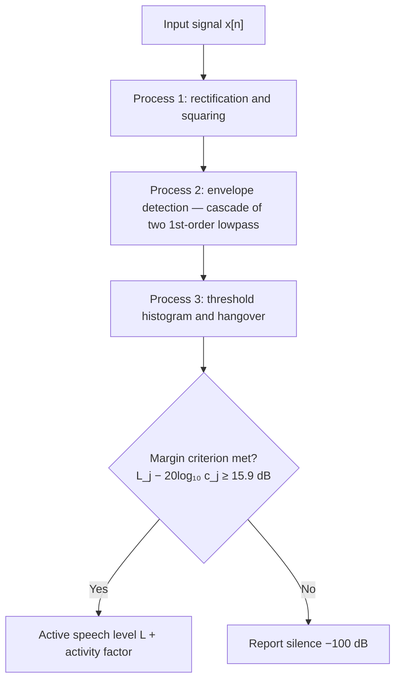

This page summarizes the objective speech-level measurement method defined by
ITU-T Rec. P.56 and how this crate implements it: the three-process signal
model, the constants, and the statistical determination of the active level.
Normative definitions remain those of the Recommendation; the wording here is
independent and reproduces only the numeric parameters needed for
interoperable re-implementations.

## Why an active level

A speech signal is active only part of the time. The long-term RMS level of a
recording therefore depends on the amount of silence it contains and does not
predict the loudness of the speech itself, while a simple peak measure is
dominated by a few isolated samples. P.56 defines an *active speech level*:
the level the speech would have if the energy of the inactive parts were
removed, computed so that it is independent of the pause structure of the
material.

## The three processes

P.56 models the measurement as three cascaded processes applied to the
input signal $x[n]$:



**Process 1 — rectification and second-moment integration.** The signal
is squared and integrated to track the long-term energy. The total
activity of the signal is derived from the ratio of the long-term energy
to the maximum amplitude squared (clause 9).

**Process 2 — envelope detection.** The rectified signal $|x[n]|$ passes
through a cascade of two identical first-order low-pass smoothing filters
with time constant $T = 0.03\ \mathrm{s}$. With
$g = e^{-1/(f T)}$ for sampling rate $f$:

```math
p[n] = g\,p[n-1] + (1 - g)\,|x[n]|, \qquad
q[n] = g\,q[n-1] + (1 - g)\,p[n].
```

**Process 3 — threshold histogram with hangover.** The envelope $q[n]$ is
compared against a geometric progression of thresholds (each successive
threshold half the previous, spanning the bit depth of the signal), and
per-threshold activity counters are extended by a hangover of
$H = 0.20\ \mathrm{s}$ after the envelope falls below the threshold. This
   bridges short pauses inside speech bursts so that pauses within a phrase
   do not count as inactive.

The activity factor is the fraction of samples counted active at the
threshold that best separates speech from silence, determined together with
the active level by the statistical rule below.

## Determination of the active level

For each candidate threshold $c_j$ the meter accumulates the energy fraction
above it, $E_j = \sum q\text{-conditioned energy above } c_j$. The active
speech level $L$ is the level $L_j$ of the signal computed with only the
samples active at threshold $c_j$, chosen such that the margin between $L_j$
and the threshold level itself satisfies

```math
L_j - 20\log_{10}(c_j) \geq M, \qquad M = 15.9\ \mathrm{dB}.
```

Among the thresholds meeting the margin criterion, the meter reports the one
with the largest coverage (smallest $j$ meeting it), which yields the
activity factor

```math
AF = \frac{N_{\text{active}}}{N_{\text{total}}}.
```

Silence (no threshold meets the margin) is reported as $-100\ \mathrm{dB}$.
The following table collects the constants as fixed by the Recommendation
and implemented in [`constants.rs`]:

| Constant                              | Symbol | Value            |
| ------------------------------------- | ------ | ---------------- |
| Smoothing time constant               | $T$    | 0.03 s           |
| Hangover time                         | $H$    | 0.20 s           |
| Margin                                | $M$    | 15.9 dB          |
| Silence report level                  | –      | −100 dB          |
| Histogram threshold progression       | –      | halving, per bit |
| Reference implementation thresholds   | –      | 15 (THRES_NO)    |

## Units and conventions

- The 0 dB reference of the reported levels is `max_amplitude` (default 1.0 →
  dBov, i.e. dB relative to overload). Passing an explicit physical scale
  (e.g. `max_amplitude = 0.7746` for dBm into 600 Ω) yields dBm0/dBPa.
- Bit depth enters once: it sets the histogram span (one threshold per bit).
  The meter is float-only internally (like the reference P.56); the CLI
  normalizes integer WAV data to float32 at the reader boundary (soundfile
  divides by 127/32767/8388607/2147483647 for 8/16/24/32-bit files).

!!! warning "Float-only input"

    The library accepts `float32`/`float64` arrays only and rejects integer
    dtypes with a `TypeError`. Normalize at the boundary — reading via
    soundfile does this automatically.

## Meter requirements behind the method

P.56 clause 10 defines electrical requirements for a physical instrument
implementing the method. They are listed here for context; a software
library has no analogue of them, but they bound the same quantities the
algorithm cares about.

- **Input impedance** (10.1.1): bridging use with 100 kΩ recommended.
- **Circuit protection** (10.1.2): withstand mains 110/240 V and 50 V
  exchange voltages.
- **Balanced/unbalanced, polarity independent** (10.1.3).
- **Protection filter** (10.2): a band-limiting filter in front of the
  analysis, specified through the tolerance corridors of Table 3/Figure 2;
  see [Pre-filter bands](prefilter-bands.md) for the NB/SWB/FB corridors
  and the implemented designs.
- **Output noise** (10.2): filter output below −75 dBm fullband
  (20–20 000 Hz) and below −90 dBmp telephone weighted.
- **Working range for speech** (10.3.1): active level at least 0 to
  −30 dBV. NOTE 1 of the Recommendation derives the sizing: a 12-bit
  converter gives a 66 dB range; allowing an 18 dB peak-to-active ratio
  (peaks above overload < 0.1 % of the time) and the margin $M = 15.9$ dB
  leaves about 35 dB headroom.
- **Software digitizer conventions** (clause 11): file-based operation at
  the native sampling rate of the material; this crate additionally
  supports resampling and blockwise streaming.

## Blockwise operation

The reference implementation is strictly sample-serial. This crate keeps the
sample-domain arithmetic as the correctness baseline
([`TimeDomainFilter`]) and adds a blockwise delivery interface: the caller
feeds blocks of up to `block_size` samples to `process_block`, and the
envelope-filter state, histogram counters and energy accumulators carry
across calls. `block_size` is a defensive upper bound on the chunk length,
not an algorithmic parameter — feeding one large block or many small ones
is bit-identical, so arbitrarily long material can be measured in bounded
memory.

## Conformance

The meter reproduces `sv56demo` reference results from ITU-T Software
Toolbox G.191 (STANAG/G.191 speech clips) within ±0.1 dB; the conformance
suite in `tests/` pins this against committed fixtures.

[`constants.rs`]: https://github.com/jr2804/p56-asl/blob/main/src/constants.rs
[`TimeDomainFilter`]: https://github.com/jr2804/p56-asl/blob/main/src/filter.rs
