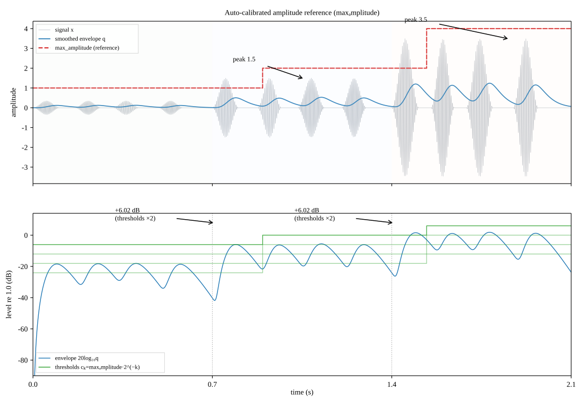

The reference P.56 implementation assumes input samples in the range
$[-1.0, 1.0]$ and reports all levels in dB relative to that full scale
(dBov). `p56-asl` keeps that contract, but adds an *extended mode*
(`auto_calibrate=True`) that adapts the measurement reference when the
signal's peak exceeds full scale, so unnormalized material is measured
correctly instead of saturating the analysis.

## The amplitude reference and the histogram grid

The meter measures the smoothed envelope $q[n]$ against a geometric grid of
thresholds:

```math
c_k = \frac{\text{max\_amplitude}}{2^k}, \qquad k = 1 \dots 23
```

The top threshold sits at `max_amplitude / 2`; each bin below it covers
half the amplitude of the one above (−6.02 dB per bin). `max_amplitude`
defaults to `1.0` (full scale), and all reported levels are dB re. full
scale (`1.0`), independent of the grid position.

## What happens when the peak exceeds full scale

If the envelope rises above the top threshold `max_amplitude / 2`, the top
histogram bins saturate: every sample is counted in every bin, the activity
counts lose their structure at the loud end, and the margin analysis
(P.56's speech/silence test) no longer resolves where the envelope sits.
The reference implementation is simply not defined for this case — its
documented input range is $[-1, 1]$.

## Extended mode (`auto_calibrate=True`)

With auto-calibration enabled, the meter watches the block peak: whenever a
block contains a sample whose magnitude exceeds the current
`max_amplitude`, the reference is doubled (repeatedly, if needed) until it
covers the peak, and the histogram follows:

- **thresholds ×2** — the grid shifts up by exactly +6.02 dB
  ($20\log_{10} 2$);
- **activity counters slide down** by the same number of bins, so every
  counter stays attached to the absolute level it was measuring;
- the new top bins, which cover levels no earlier sample could reach,
  start fresh.

Because the counters stay attached to their absolute levels, the
measurement itself is unaffected by the shifts: the reported active level,
activity factor and RMS are identical to what the meter would have
reported had the reference been configured to the final value from the
start. The calibration exists so the grid *covers* the signal — it never
changes what is measured, only the resolution at the loud end.

The extended mode is a library option; the CLI does not expose it:

```python
from p56_asl import ActiveSpeechLevelMeter

meter = ActiveSpeechLevelMeter(sample_rate=48000.0, auto_calibrate=True)
```

## Illustration

The figure below shows a synthetic burst signal whose peak steps from
`0.35` (well below full scale) to `1.5` and then to `3.5`:



**A** — the signal with its smoothed envelope $q$, and the adapting
reference `max_amplitude` (dashed red). The first phase stays below
full scale, so the reference remains `1.0`. When the first `1.5` peak
arrives, the block triggers a doubling: `max_amplitude 1.0 → 2.0`. The
`3.5` peak later triggers another: `2.0 → 4.0`.

**B** — the envelope and the histogram threshold grid
$c_k = \text{max\_amplitude}\cdot 2^{-k}$ (green), all in dB re. full
scale. Each doubling lifts every threshold by exactly **+6.02 dB** — the
grid shifts as a rigid staircase at the two calibration instants, and the
envelope, which would otherwise sit far above the top threshold, is again
covered by the grid.

The thresholds shown ($k = 1 \dots 4$) are the top four bins of the
23-bin grid; the remaining bins follow the same staircase below the
plotted range.

## Reproducing the figure

The figure is generated by `scripts/gen_extended_mode_figure.py`:

```bash
uv run python scripts/gen_extended_mode_figure.py
```
